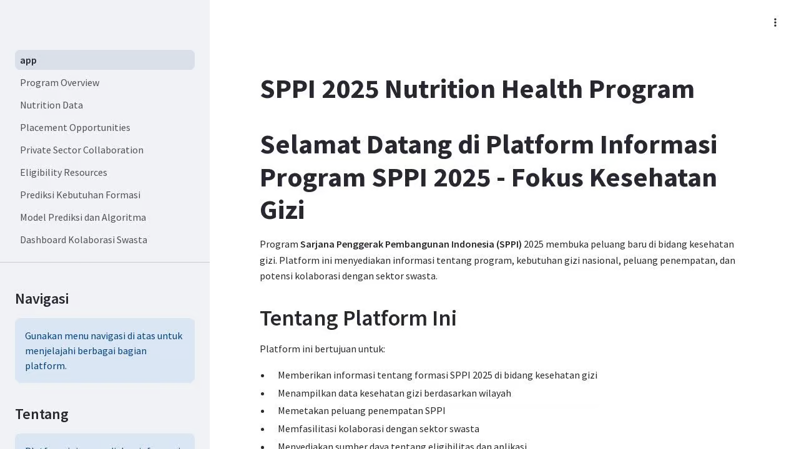

# SPPI 2025 - Platform Informasi dan Visualisasi Program Kesehatan Gizi

Aplikasi ini merupakan platform berbasis Streamlit untuk informasi, visualisasi data, dan prediksi kebutuhan program kesehatan gizi SPPI (Sarjana Penggerak Pembangunan Indonesia) 2025.



## Tentang Aplikasi

Aplikasi ini dikembangkan untuk mendukung program SPPI 2025 dalam bidang kesehatan gizi dengan menyediakan:

1. Informasi komprehensif tentang program SPPI 2025
2. Visualisasi data kesehatan gizi di seluruh Indonesia
3. Peta interaktif untuk kesempatan penempatan
4. Analisis peluang kolaborasi dengan sektor swasta
5. Informasi persyaratan dan sumber daya program
6. Model prediksi kebutuhan formasi SPPI
7. Penjelasan metodologi dan algoritma prediksi
8. Dashboard untuk kolaborasi dengan sektor swasta

## Fitur Utama

### 1. Beranda
Halaman utama yang menjelaskan tujuan program SPPI 2025 dalam bidang kesehatan gizi dan navigasi ke halaman-halaman lainnya.

### 2. Program Overview
Informasi detail tentang program SPPI 2025, termasuk visi, misi, tujuan, dan sasaran program.

### 3. Nutrition Data
Visualisasi interaktif data gizi nasional, termasuk prevalensi stunting, wasting, dan indikator kesehatan gizi lainnya.

### 4. Placement Opportunities
Peta interaktif menunjukkan peluang penempatan SPPI di seluruh Indonesia dengan informasi detail tentang kebutuhan dan lingkungan.

### 5. Private Sector Collaboration
Informasi tentang peluang kolaborasi antara program SPPI dan sektor swasta dalam mengatasi tantangan kesehatan gizi.

### 6. Eligibility Resources
Persyaratan kelayakan, proses aplikasi, dan sumber daya untuk calon peserta program SPPI 2025.

### 7. Prediksi Kebutuhan Formasi
Model prediktif untuk kebutuhan formasi SPPI 2025 berdasarkan indikator kesehatan, demografis, dan pendidikan.

### 8. Model Prediksi dan Algoritma
Penjelasan detail tentang metodologi, sumber data, dan algoritma yang digunakan dalam model prediksi kebutuhan formasi.

### 9. Dashboard Kolaborasi Swasta
Dashboard interaktif untuk memfasilitasi kolaborasi antara program SPPI dan sektor swasta.

## Teknologi yang Digunakan

- Streamlit: Framework untuk membangun aplikasi web interaktif
- Pandas: Analisis dan manipulasi data
- Plotly: Visualisasi data interaktif
- Folium: Peta interaktif
- Matplotlib & Seaborn: Visualisasi data statis
- NumPy: Komputasi numerik

## Cara Menggunakan

1. Navigasi menggunakan sidebar di sebelah kiri untuk mengakses berbagai halaman.
2. Gunakan filter dan kontrol interaktif pada setiap halaman untuk menyesuaikan visualisasi.
3. Pada halaman prediksi, sesuaikan parameter untuk menjelajahi skenario yang berbeda.
4. Unduh laporan atau data dari berbagai halaman sesuai kebutuhan.

## Mengembangkan Aplikasi

Aplikasi ini dikembangkan menggunakan Streamlit dan dapat dijalankan secara lokal menggunakan perintah:

```
streamlit run app.py
```

Untuk pengembangan lebih lanjut:

1. Tambahkan file Python baru ke folder `pages/` untuk halaman tambahan
2. Gunakan `utils/` untuk fungsi utilitas yang digunakan di beberapa halaman
3. Tambahkan data baru ke struktur yang sesuai di `utils/data_utils.py`

## Kontak

Untuk informasi lebih lanjut tentang aplikasi ini atau program SPPI 2025, silakan hubungi:

- Email: info@sppi.kemdikbud.go.id
- Telepon: (021) 5790-3335
- Website: https://sppi.kemdikbud.go.id

## Lisensi

habizinnia@gmail.com